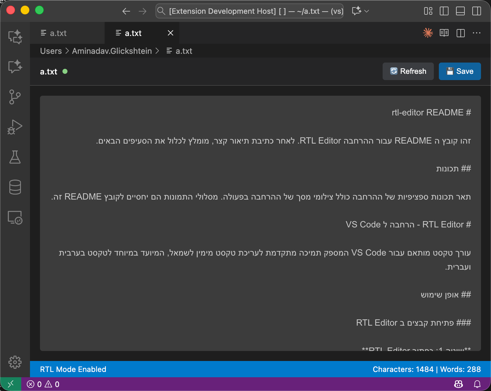

# RTL Editor - VS Code Extension

A custom text editor extension for VS Code that provides enhanced support for right-to-left (RTL) text editing, specifically designed for Arabic and Hebrew text.

## How to Use

### Opening Files in RTL Editor

**Method 1: RTL Editor Button**
- Open any `.txt` or `.md` file in VS Code
- Look for the RTL Editor button (📖) in the top-right of the editor toolbar
- Click the button to open the file in RTL Editor

**Method 2: Context Menu**
- Right-click on any file in Explorer → "Open in RTL Editor"
- Right-click in an open editor → "Open in RTL Editor"

**Method 3: Command Palette**
- Press `Ctrl/Cmd+Shift+P`
- Type "RTL Editor: Open in RTL Editor"
- Or type "RTL Editor: Create New RTL File"

### Working with RTL Text

**Basic Usage:**
- Type directly in Arabic, Hebrew, or mixed content
- Text direction is automatically detected and adjusted
- Files save automatically when you switch away from the editor
- Use `Ctrl/Cmd+S` for manual save

**External File Changes:**
- If the file is modified outside VS Code, you'll see a notification bar
- Click "Refresh" to load the external changes
- Click "×" to dismiss the notification

### Keyboard Shortcuts

- `Ctrl/Cmd+S` - Save file
- `Ctrl/Cmd+Shift+X` - Toggle text direction (RTL/LTR)
- `Ctrl/Cmd +` - Increase font size
- `Ctrl/Cmd -` - Decrease font size
- `Ctrl/Cmd 0` - Reset font size

### Settings

Access settings via `File → Preferences → Settings` and search for "RTL Editor":

- **Show Editor Button** - Display RTL Editor button in editor toolbar (default: enabled)
- **Auto Detect RTL** - Automatically detect and adjust text direction (default: enabled)
- **Save Confirmation Duration** - How long to show "File saved" message (default: 3 seconds)

### File Types

The RTL Editor works with:
- `.txt` files - Plain text
- `.md` files - Markdown
- `.rtl` files - Custom RTL files
- Any file type (using "Open in RTL Editor" command)

## Features

- **Native RTL Support** - Proper right-to-left text rendering
- **Mixed Content** - Handles both RTL and LTR text automatically
- **Auto-save** - Saves automatically when you switch away from the editor
- **External Change Detection** - Notifies when files are modified outside VS Code
- **Responsive Design** - Editor auto-resizes based on content
- **Minimal Interface** - Clean, distraction-free editing environment
- **Full-screen Editing** - Maximum space for your text

## License

MIT License
